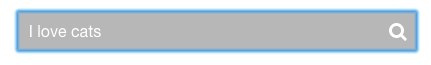
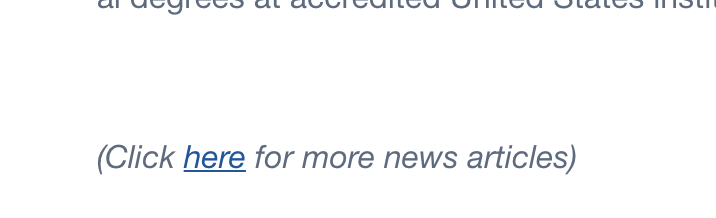
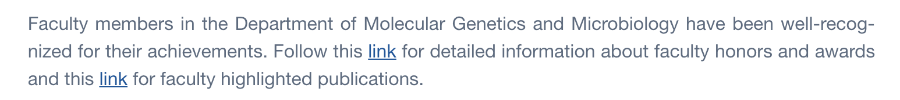
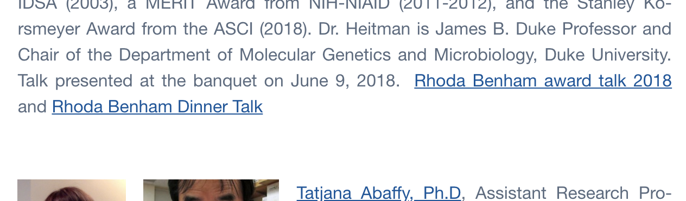

<style>
img { max-width:400px; height: auto;}
img,iframe {border: 1px solid #ccc;}
a { color: blue; }
pre code { font: 9px; }
pre { font: inherit; word-wrap: break-word; background: none; border: none; }
.force-thumbnail { width: 150px; }
.force-thumbnail img { height: auto; }
</style>

# Mgm.duke.edu/ Assessment

__<https://mgm.duke.edu/>__

__Screenshot:__


# Accessibility


## Main menu is not keyboard accessible

Main menu needs to be keyboard accessible for people who cannot use a mouse and for screen reader compatibility.

Good news! Its a super easy fix with big payoff to help people with disabilities.  Just paste code in any JS file after the jQuery script is loaded.

```js
// function to control aria attributes and styles
function toggleVisibility(trigger, target) {
    var expandedState = trigger.attr('aria-expanded');

    /* toggle attributes */
    if (expandedState == 'true') {
        trigger.attr('aria-expanded', 'true');
        target.attr('aria-hidden', 'false')
            .fadeIn()
            .css({
                'display': 'block',
                'visibility': 'visible',
                'opacity': '1'
            });
    }
    else {
        trigger.attr('aria-expanded', 'false');
        target.attr('aria-hidden', 'true')
            .fadeOut()
            .css({
                'display': 'none',
                'visibility': 'hidden',
                'opacity': '0'
            });
    }
}

// set targets (the submenus <ul>) and triggers (<a> menu items with submenus)
var $mainMenu = jQuery('#menu-main-menu').attr('aria-label', 'main menu');
var $menuItem = $mainMenu.find('> li').has('ul');
var $toggleTrigger = $menuItem.find('> a');
var $toggleTarget = $menuItem.find('> ul');

// set initial aria attributes
$toggleTrigger.attr('aria-haspopup', 'true').attr('aria-expanded', 'false');
$toggleTarget.attr('aria-visible', 'false');

// on keyboard focus of a menu item <a> with a submenu
$toggleTrigger.on('focus', function(e) {
    var $trigger = jQuery(this);
    var $target = jQuery(this).parent().find('> ul');

    $trigger.keydown(function(e) {
        if (e.keyCode === 40) {
            jQuery(this).attr('aria-expanded', 'true');
            toggleVisibility($trigger, $target);
            return false;
        }
        if (e.keyCode === 38) {
            jQuery(this).attr('aria-expanded', 'false');
            toggleVisibility($trigger, $target);
            return false;
        }
    });
});

// On mouseenter and mouseleave explicitly reset aria attributes to correct value for this specific dropdown
// to ensure they stay in sync if people alternate between keyboard and mouse or if the browser cannot keep up.
// yes, $menuItem is the correct selector so it works on all screen readers
$menuItem.mouseenter(function() {
    var $trigger = jQuery(this).find('> a');
    var $target = jQuery(this).find('> ul');
    $trigger.attr('aria-expanded', 'true');
    toggleVisibility($trigger, $target);
});
$menuItem.mouseleave(function() {
    var $trigger = jQuery(this).find('> a');
    var $target = jQuery(this).find('> ul');
    $trigger.attr('aria-expanded', 'false');
    toggleVisibility($trigger, $target);
});
```


<br>

## HTML5 landmark elements are used to improve navigation
Manual Test: HTML5 landmark elements are used to improve navigation

Description:<br>
Landmark elements (&lt;main&gt;, &lt;nav&gt;, etc.) are used to improve the keyboard navigation of the page for assistive technology. [Learn more](https://developers.google.com/web/fundamentals/accessibility/how-to-review#take_advantage_of_headings_and_landmarks).

This is almost there.  It is just missing a `<main>` element.

__HTML locataion:__

```html
<div class="banner full-width">...</div>
<div class="content" id="main-content">...</div>
```

### Suggested solution:

Add a `<main>` element around the content area.

```html
+ <main>
    <div class="banner full-width">...</div>
    <div class="content" id="main-content">...</div>
+ </main>
```

This needs done on the homepage as well as the subpage templates.

<br>

<hr>

<br>

## Banner issues


### Banner has text in an image. 

Text is not allowed in images unless "[A particular presentation of text is essential to the information being conveyed.](https://www.w3.org/TR/UNDERSTANDING-WCAG20/visual-audio-contrast-text-presentation.html)" 

This rule is subjective, but in this scenario it is possible to use "Live" text, meaning it is real HTML text overlaid on a background image. 

Technically, it is possible to put all these words in the `alt` attribute, but we have gotten in trouble for doing so. Due to its prominence as the largest image on the website and being on the front page we need to use real text.

#### Suggested solution:

Use real headings and text.  If mgm.duke.edu would like assistance writing the HTML and CSS to accomplish a similar look, we can write something up real quick for mgm.duke.edu.

### There is an empty `<h1>` hidden in the banner.

To a screen reader this would read "Heading". Which does not provide information on what this page is about.  

#### Suggested solution:

Add text "Duke University School of Medicine Department of Molecular Genetics and Microbiology".  Optimally, use that as the real text to overlay on the new suggested background image.

### There is an `<a>` link has no text inside, a screen reader would read "Link".

Link text (and alternate text for images, when used as links) that is discernible, unique, and focusable improves the navigation experience for screen reader users. [Learn more](https://dequeuniversity.com/rules/axe/2.2/link-name?application=lighthouse).

The word "link" does not provide context on what the link is or where it will take them.

__HTML Location__:

```html
<a href="" class="duke-medicine-blue-btn btn"></a>
```
Empty links are not read to a screen reader user, as a result, they will have no idea what the link does or where it would take them.

#### Suggested solution:

Remove the empty link.

<details>
<summary>_Additional debugging details_</summary>
Selector:<br>
<code>5,HTML,2,BODY,1,DIV,1,DIV,0,DIV,1,A</code>

Path:<br>
<code>.duke-medicine-blue-btn</code>

More detailed explanation:<br>
Fix all of the following:
<br>Element is in tab order and does not have accessible text

Fix any of the following:
<br>Element does not have text that is visible to screen readers
<br>aria-label attribute does not exist or is empty
<br>aria-labelledby attribute does not exist, references elements that do not exist or references elements that are empty or not visible
<br>Element&#39;s default semantics were not overridden with role=&#34;presentation&#34;
<br>Element&#39;s default semantics were not overridden with role=&#34;none&#34;
</details>


<br>

<hr>

<br>

## Background and foreground colors do not have a sufficient contrast ratio.

Low-contrast text is difficult or impossible for many users to read. [Learn more](https://dequeuniversity.com/rules/axe/2.2/color-contrast?application=lighthouse).


<input type="image" src="https://mgm.duke.edu/wp-content/themes/som-theme/library/images/icon-search.png" border="0" alt="Submit" class="submit-icon">


### The element _"Search"_ has low contrast.

__Visual location:__




__HTML location:__

```html
<input type="text" value="" name="s" id="s" placeholder="Search" class="search-input">
```

#### Suggested solution:

  Element has insufficient color contrast of 2 (foreground color: #ffffff, background color: #b7b7b7, font size: 12.0pt, font weight: normal). Expected contrast ratio of 3:1
  
Change to the closest compliant color of #949494
https://webaim.org/resources/contrastchecker/?fcolor=FFFFFF&bcolor=767676

```css
.header .search .widget_search .search-input {
  float: right;
  line-height: 20px;
-  background: #767676;
+  background: #949494;
  color: #fff;
}
```


<details>
<summary>_Additional debugging details_</summary>
Selector:<br>
<code>5,HTML,2,BODY,1,DIV,0,HEADER,0,DIV,1,DIV,0,DIV,0,FORM,0,DIV,1,INPUT</code>

Path:<br>
<code>#s</code>

More detailed explanation:<br>
Fix any of the following:
<br>Element has insufficient color contrast of 2 (foreground color: #ffffff, background color: #b7b7b7, font size: 12.0pt, font weight: normal). Expected contrast ratio of 4.5:1
</details>

<br>

<hr>

<br>

## Input has no value

Search element has not have a `value` or text inside it. It does have an `alt` attribute, but `alt` is only a valid attribute on images.

### Search box

__Visual location:__


__HTML location:__

```html
<input type="image" src="https://mgm.duke.edu/wp-content/themes/som-theme/library/images/icon-search.png" border="0" alt="Submit" class="submit-icon">
```

#### Suggested solution:

Add value="Search".

```html
<input type="image" 
       src="https://mgm.duke.edu/wp-content/themes/som-theme/library/images/icon-search.png" 
       border="0" 
-       alt="Submit"
+       value="search"
       class="submit-icon">

```

<br>

<hr>

<br>

## Inaccurate or missing `alt` text in images

### Insufficient `alt` text in logo

Link text (and alternate text for images, when used as links) that is discernible, unique, and focusable improves the navigation experience for screen reader users. [Learn more](https://dequeuniversity.com/rules/axe/2.2/link-name?application=lighthouse).

__Visual location:__


__HTML location:__

```html
<div class="site-logo">
  <a href="https://mgm.duke.edu/" title="MGM" rel="home">
    
  </a>
</div>
```

#### Suggested solution:

Change `alt` text to "Duke Molecular Genetics and Microbiology"

### People photos missing `alt` text on homepage

Technically, it is permissible to use the `alt` attribute if the image is superfluous or the text surrounding the images is sufficient to describe it. So, by the letter of the law this technically this is not a real concern.  However, in litigation, it has been my experience that lawyers do not understand that and have brought it up to support claims of a website being inaccessible. 

#### Suggested solution:

Add `alt` text to all the images.


## Some link text is not descriptive 

Link text (and alternate text for images, when used as links) that is discernible, unique, and focusable improves the navigation experience for screen reader users. [Learn more](https://dequeuniversity.com/rules/axe/2.2/link-name?application=lighthouse).

If a screen reader user comes across the link, it will just read "Here" which does not provide context on what the link is or where it will take them.

### Click "here" near footer

__Visual location:__

 

__HTML location:__

```html
<em>(Click <a title="NEWS" href="/about-the-department/news-3/">here</a> for more news articles)</em>
```

#### Suggested solution:

Make the entire sentences a link, or anything that is descriptive.


### More "link" in appears multiple times on [About the Department page](https://mgm.duke.edu/about-the-department/) and other pages

If a screen reader user comes across the link, it will just read "link" which does not provide context on what the link is or where it will take them.

__Visual location:__

 

__HTML location:__

```html
<p style="text-align: justify;">
  Faculty members in the Department of Molecular Genetics and Microbiology have been well-recognized for their achievements. Follow this 
  <a href="https://mgm.duke.edu/about-the-department/faculty-awards-and-honors/">link</a> 
  for detailed information about faculty honors and awards and this 
  <a href="https://mgm.duke.edu/about-the-department/faculty-highlighted-publications/">link</a> 
  for faculty highlighted publications.
</p>
```

#### Suggested solution:

Make the entire sentences a link, or anything that is descriptive.

<br>

<hr>

<br>

## Inaccessible PDF

All the WCAG rules about web content also apply to documents, because they are also web content.  This means that all documents need to be accessible.

### The "Rhoda Benham Dinner Talk" Doc
<https://mgm.duke.edu/wp-content/uploads/2018/06/Rhoda-Benham-dinner-talk-finalized.doc>

### and "Rhoda Benham award talk 2018" PDF are not accessible

<https://mgm.duke.edu/wp-content/uploads/2018/06/Rhoda-Benham-award-talk-2018compact.pdf>

__Visual location:__



It is missing alt text, tags, reading order, etc. [Learn more about PDF remediation](https://helpx.adobe.com/acrobat/using/create-verify-pdf-accessibility.html#check_accessibility_of_PDFs)

#### Suggested solution:

Making the PDF document accessible is too difficult to provide solution to here. Please attend our "PDF and Accessible Document Workshop" on November 13th.  We will send an email reminder out to all the Web Accessibility Liaisons closer to the training date. Please save the date. PDF accessibility is one of Duke's number one risks right now. We are making a concerted effort to mitigate the risk.

For future documents, please [checkout out our tutorial on how to make accessible documents](https://duke.app.box.com/s/2lbwot3eet82vxhep3n9r207kwobtjxj) and ensure they are accessible before posting.

For now, I will remediate this PDF for mgm.duke.edu and return it to you. 

<br>

<hr>

<br>


This report was partially generated by the [aXe Accessibility Engine](https://chrome.google.com/webstore/detail/axe/lhdoppojpmngadmnindnejefpokejbdd), [Lighthouse](https://developers.google.com/web/tools/lighthouse/), and the [WAVE](https://chrome.google.com/webstore/detail/wave-evaluation-tool/jbbplnpkjmmeebjpijfedlgcdilocofha) browser extension and extensive manual testing.
